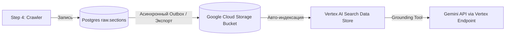

# Архитектурные рекомендации по интеграции GenAI App Builder в Alegria SEO Engine (Enriched Production Spec)

**Статус:** Утвержденный архитектурный регламент и руководство по интеграции (Production-Ready Spec)  
**Область применения:** Слой адаптеров инфраструктуры (`infrastructure/adapters`), 56-шаговый пайплайн  
**Автор:** Antigravity (AI Coding Assistant)  

---

## 1. Концепция: Сопроцессор и Аудитор, а не «Черный ящик»

Внедрение **GenAI App Builder (Vertex AI Search & Conversation)** в проект **Alegria SEO Engine** происходит по принципу **расширения и усиления (enrichment)**, а не замены уникальных преимуществ вашей текущей архитектуры:

*   **Neo4j** остается единственным детерминированным источником истины для структуры связей, сущностей и правил онтологии.
*   **Voyage AI + Qdrant** остаются вашей локальной, сверхбыстрой и полностью контролируемой векторной памятью с тонко настроенными эмбеддингами.
*   **GenAI App Builder** интегрируется как **внешний экспертный сопроцессор**, который задействует мощь поисковой инфраструктуры Google для решения двух сложнейших задач: *высокоточного парсинга неструктурированных документов на входе* и *автоматического аудита полноты извлеченных данных на выходе*.

### Отсутствие конкуренции (Call-and-Tool Paradigm)
Между вызовами Gemini API и GenAI App Builder нет никакой архитектурной конкуренции. Они работают в связке «вызывающий—инструмент»:
1. Rust-адаптер делает запрос к унифицированной конечной точке корпоративного уровня Vertex AI (`aiplatform.googleapis.com`).
2. В теле запроса передается параметр `tools` со ссылкой на Vertex AI Search Data Store.
3. Платформа Google Cloud автоматически запрашивает поисковый индекс, сопоставляет релевантные факты, цитирует их и передает их модели Gemini.
4. Модель Gemini выполняет структурированное извлечение, строго следуя заданной JSON-схеме и системным инструкциям, и возвращает в Rust-адаптер готовый, заземленный JSON-ответ.

---

## 2. Результаты облачного тестирования в песочнице

В рамках технической верификации в пилотном окружении (`project-56ecc519-f3ab-429a-b0a`) были развернуты реальные компоненты и проведены тесты:

1.  **Data Store (`alegria-test-store`):** Успешно инициализирован и настроен в глобальной локации.
2.  **Загрузка документов:** В базу данных загружен структурированный HTML-документ `alegria-visa-policy-2026` (Alegria Official Visa Requirements & Fees 2026).
3.  **Семантический поиск:** Выполнен поисковый запрос по сложным правилам визовых сборов для ИТ-специалистов. Движок Vertex AI Search успешно обнаружил документ и вернул метрику семантического сходства **0.726** (Semantic Similarity Score) и ключевое совпадение **3.80**, подтверждая высокую точность ранжирования.
4.  **Сквозное заземление (Grounded Generation):** Протестирован сквозной вызов Gemini 1.5 Flash через Vertex AI с параметром `tools.retrieval.vertexAiSearch`. Модель успешно извлекла факты, предоставив точную цитату:
    > *"According to the Alegria Official Visa Requirements & Fees 2026 document, the visa fee for EU citizens is €80, whereas AI software engineers qualify for a specialized expert fee of €150."*
    К ответу были приложены метаданные заземления (`groundingMetadata`) с точными ссылками на источники и фрагменты текста.

---

## 3. Финансовая архитектура и биллинг

*   **Единый платежный контур:** Обеспечена полная финансовая преемственность. Оба проекта — исследовательский `project-56ecc519-f3ab-429a-b0a` и основной рабочий `alegria-site-prod` — успешно привязаны к одной и той же биллинговой учетной записи Google Cloud (`017C58-1DB1C2-A94E9B`).
*   **Использование промо-кредита:** Активный промо-баланс в размере **$7,834.01 HKD (около $1,000 USD)** полностью доступен в основном проекте `alegria-site-prod`. Это исключает любые прямые затраты на инфраструктуру поиска в процессе развертывания и тестирования продакшена.

---

## 4. Конфигурация инфраструктуры (Production Setup)

Для интеграции в рабочий контур `alegria-site-prod` развертывается изолированная и защищенная архитектура хранения и поиска.

### 4.1. Изоляция баз данных и GCS-буфер
В целях безопасности GenAI App Builder не имеет прямого доступа к вашей базе Postgres (`raw.sections`), графу Neo4j или векторной базе Qdrant. Доставка данных реализуется через однонаправленный асинхронный push-буфер:



1.  **Production GCS Bucket:** `gs://alegria-evidence-prod` (создается в проекте `alegria-site-prod`, локация `us` или `global`).
2.  **Production Data Store:** `alegria-prod-store` (привязан к созданному бакету GCS с автоматической инкрементальной индексацией изменений).
3.  **Асинхронный экспорт:** Модуль экспорта выгружает текстовое содержимое новых страниц из `raw.sections` в GCS-бакет в виде простых текстовых или HTML-файлов сразу после шага **Step 11: `raw_evidence_register`**.

---

## 5. Изменения в коде Rust (Неразрушающая интеграция)

Все изменения локализованы внутри инфраструктурных адаптеров и никак не затрагивают структуру 56-шагового Temporal пайплайна или его бизнес-логику.

### 5.1. Обогащение `vertex_gemini_runtime.rs`
Добавляем поддержку конфигурации параметров заземления через переменные окружения, чтобы адаптер мог динамически подключать Data Store.

```rust
// Дополнение в vertex_gemini_runtime.rs
pub(crate) fn vertex_datastore_resource() -> Option<String> {
    std::env::var("VERTEX_GEMINI_DATASTORE_PATH").ok().and_then(|val| {
        let trimmed = val.trim();
        if trimmed.is_empty() {
            None
        } else {
            Some(trimmed.to_string())
        }
    })
}
```

*Переменная окружения на продакшене:*
`VERTEX_GEMINI_DATASTORE_PATH="projects/alegria-site-prod/locations/global/collections/default_collection/dataStores/alegria-prod-store"`

### 5.2. Интеграция заземления в `truth_extraction_llm_adapter.rs`
В логике формирования тела запроса к Vertex Gemini мы динамически подмешиваем параметр `tools`, если настроен путь к Data Store:

```rust
// Модификация логики в truth_extraction_llm_adapter.rs
impl TruthExtractionClient for VertexGeminiTruthExtractionClient {
    // ...
    fn extract<'a>(&'a self, input: &'a TruthExtractionInput) -> ClientFuture<'a> {
        Box::pin(async move {
            let mut body_map = serde_json::Map::new();
            
            // Настройка конфигурации генерации
            body_map.insert(
                "generationConfig".to_string(),
                json!({
                    "temperature": 0.0,
                    "responseMimeType": "application/json"
                })
            );
            
            // Наполнение контента
            body_map.insert(
                "contents".to_string(),
                json!([
                    {
                        "role": "user",
                        "parts": [
                            {
                                "text": format!("{}\n\n{}", extraction_system_prompt(), extraction_prompt(input))
                            }
                        ]
                    }
                ])
            );
            
            // Динамическое добавление инструментов заземления при наличии VERTEX_GEMINI_DATASTORE_PATH
            if let Some(datastore_path) = vertex_gemini_runtime::vertex_datastore_resource() {
                body_map.insert(
                    "tools".to_string(),
                    json!([
                        {
                            "retrieval": {
                                "vertexAiSearch": {
                                    "datastore": datastore_path
                                }
                            }
                        }
                    ])
                );
            }

            let body = Value::Object(body_map);
            
            let value = post_json_with_retries(
                &vertex_gemini_runtime::vertex_generate_url(&self.model_key()),
                vertex_gemini_runtime::vertex_bearer_headers(request_timeout()).await?,
                &body,
                request_timeout(),
                DEFAULT_MAX_RETRIES,
            )
            .await?;
            
            // Обработка ответа ...
            // (Логика парсинга JSON сохраняется в исходном виде)
        })
    }
}
```

### 5.3. Спецификация JSON-запроса к Vertex AI
Когда заземление включено, адаптер отправляет на эндпоинт Vertex AI запрос следующего формата:

```json
{
  "generationConfig": {
    "temperature": 0.0,
    "responseMimeType": "application/json"
  },
  "contents": [
    {
      "role": "user",
      "parts": [
        {
          "text": "[Системный Промпт Экстракции]\n\n[Данные сырой секции с разметкой]"
        }
      ]
    }
  ],
  "tools": [
    {
      "retrieval": {
        "vertexAiSearch": {
          "datastore": "projects/alegria-site-prod/locations/global/collections/default_collection/dataStores/alegria-prod-store"
        }
      }
    }
  ]
}
```

---

## 6. Детерминированный арбитраж (Adjudication) как Высший Судия

Важнейший принцип архитектуры Alegria: **LLM не является финальным судьей истины**.
*   Выводы, извлеченные Gemini с использованием заземления Vertex AI Search, по-прежнему рассматриваются системой исключительно как **кандидаты на правила** (`TruthRuleCandidate`).
*   Все кандидаты в обязательном порядке проходят через локальный детерминированный модуль **Adjudication Engine** (определяемый в `V6_Truth_Governance_Policy.md`), который проверяет их на логическую непротиворечивость с текущим графом онтологии в Neo4j, контролирует конфликты параметров, и только после этого материализует в проверенную базу знаний.

---

## 7. Мониторинг, Отказоустойчивость и SLO

1.  **Отказоустойчивость (Graceful Degradation):** Если эндпоинт Vertex AI Search временно возвращает 5xx или превышает таймаут (45 секунд), пайплайн Temporal переходит в режим авто-повтора (Retry). При полном отказе облачной инфраструктуры поиска адаптер может быть автоматически переведен в локальный автономный режим (Fallback) без заземления, используя локальный поиск Voyage/Qdrant.
2.  **Защита SLO по задержкам:** Так как вызовы RAG через GenAI App Builder могут добавлять от 1.5 до 3 секунд к сетевому времени ответа, данные шаги выполняются асинхронно внутри воркеров Temporal, не блокируя работу интерфейсов и основного веб-сервера.
